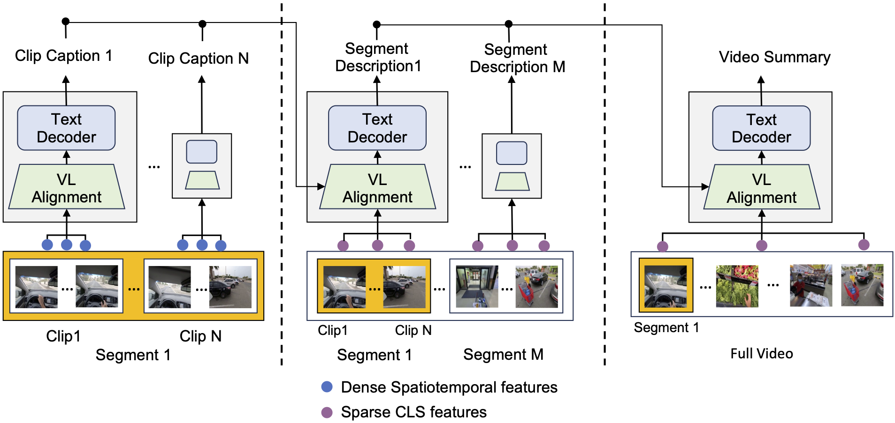

# Video ReCap

[Video ReCap: Recursive Captioning of Hour-Long Videos](https://arxiv.org/abs/2402.13250)\
Md Mohaiminul Islam, Ngan Ho, Xitong Yang, Tushar Nagarajan, Lorenzo Torresani, Gedas Bertasius\
Accepted by **CVPR 2024**\
[[Website](https://sites.google.com/view/vidrecap)] [[Paper](https://arxiv.org/abs/2402.13250)] [[Dataset](https://github.com/md-mohaiminul/VideoRecap/blob/master/datasets.md)] [[Hugging Face](https://huggingface.co/papers/2402.13250)] [[Demo](demo.ipynb)]

ViderReCap is a recursive video captioning model that can process very long videos (e.g., hours long) and output video captions at multiple hierarchy levels: short-range clip captions, mid-range segment descriptions, and long-range video summaries. First, the model generates captions for short video clips of a few seconds. As we move up the hierarchy, the model uses sparsely sampled video features and captions generated at the previous hierarchy level as inputs to produce video captions for the current hierarchy level.

 

## Installation
See [installation.md](installation.md) to install this code.

## Ego4D-HCap Dataset

See [datasets.md](datasets.md) for the details and download the Ego4D-HCap Dataset.

## [Demo Notebook](demo.ipynb)

First, download the pretrained models from [this link](https://drive.google.com/drive/folders/1q-A3YYB1VaZ9JQqe49UwVja-f-r6HJZJ?usp=sharing). Then, you can extract three-levels of hierarchical captions using our pretrained models as shown in ```demo.ipynb``` notebook.

## Download or extract features
We utilize the video encoder of pretrained Dual-Encoder from [LaViLa](https://github.com/facebookresearch/LaViLa/blob/main/docs/MODEL_ZOO.md) to extract features. \
**You can directly download the extracted features (~30 GB) from [this link](https://drive.google.com/drive/folders/1vxslxr-la8acGhb0lN4y2qlE6JaKK8X9?usp=sharing) (coming soon)**. \
Alternatively, you may extract the features on your own using the following steps.

1. Download the pretrained video encoder using the following command.
```bash
wget https://dl.fbaipublicfiles.com/lavila/checkpoints/dual_encoders/ego4d/clip_openai_timesformer_base.baseline.ep_0003.pth
```
2. Extract segment features.
```bash
bash scripts/extract_features_segments.sh
```
3. Extract video features.
```bash
bash scripts/extract_features_videos.sh
```

## Evaluate Pretrained Models

We provide our best model for both Video ReCap and Video ReCap-U. \
**Download the pretrained models from [this link](https://drive.google.com/drive/folders/1q-A3YYB1VaZ9JQqe49UwVja-f-r6HJZJ?usp=sharing)**
1. Evaluate Video ReCap.
```bash
bash scripts/eval_video_recap.sh
```
2. Evaluate Video ReCap-U.
```bash
bash scripts/eval_video_recap_u.sh
```

You should get the following numbers.

| Model | Clip Caption<br>(C/ R/ M) | Segment Description<br>(C/ R/ M) | Video Summary<br>(C/ R/ M) | Checkpoint |
| --- | --- | --- | --- | --- |
Video ReCap | 98.35/ 48.77/ 28.28 | 46.88/ 39.73/ 18.55 | 29.34/ 32.64/ 14.45 | [download](https://drive.google.com/drive/folders/1KlIbqhZ2lfngs0hc32zK2nnMVquYfzaC?usp=sharing)
Video ReCap-U | 92.67/ 47.90/ 28.08 | 45.60/ 39.33/ 18.17 | 31.06/ 33.32/ 14.16 | [download](https://drive.google.com/file/d/1vWQIgxp0m2j32Z8MqspEuK_UM63gNVLo/view?usp=sharing)

## Train Video ReCap Model

Video ReCap is a recursive model for hierarchical video captioning that uses captions generated at the previous level as input for the current hierarchy. We train Video ReCap utilizing the following curriculum learning strategy.

1. Download pretrained Dual-Encoder from [LaViLa](https://github.com/facebookresearch/LaViLa/blob/main/docs/MODEL_ZOO.md) using the following command.
```bash
mkdir pretrained_models
cd pretrained_models
wget https://dl.fbaipublicfiles.com/lavila/checkpoints/dual_encoders/ego4d/clip_openai_timesformer_base.baseline.ep_0003.pth
cd ..
```

2. First, train for 5 epochs using the clip captions data.
```bash
bash scripts/run_videorecap_clip.sh
```
3. Then extract captions at each 4 seconds interval for the whole video using the trained clip captioning model of step 1. Replace the 'captions_pred' of the train and val metadata using generated captions from appropriate time windows (See [datasets.md](datasets.md) for more details).
```bash
bash scripts/extract_captions.sh
```
4. Initialize from Video ReCap clip checkpoint and train for 10 epochs using the segment descriptions.
```bash
bash scripts/run_videorecap_segment.sh
```
5. Extract segment descriptions using the at each 180 seconds interval for the whole video using the trained clip captioning model of step 3. Replace the 'segment_descriptions_pred' of the train and val metadata using generated descriptions from appropriate time windows (See [datasets.md](datasets.md) for more details).
```bash
bash scripts/extract_segment_descriptions.sh
```
6. Finally, initialize from Video ReCap segment checkpoint and train for 10 epochs using the video summaries.
```bash
bash scripts/run_videorecap_video.sh
```

## Train Video ReCap-U Model

While Video ReCap trains three different sets of trainable parameters for three hierarchies, Video ReCap-U trains only one set of trainable parameters. Following curriculum learning scheme with an alternate batching technique allows us to train a unified model and avoid catestrophic foregetting.

1. Download pretrained Dual-Encoder from [LaViLa](https://github.com/facebookresearch/LaViLa/blob/main/docs/MODEL_ZOO.md) using the following command.
```bash
mkdir pretrained_models
cd pretrained_models
wget https://dl.fbaipublicfiles.com/lavila/checkpoints/dual_encoders/ego4d/clip_openai_timesformer_base.baseline.ep_0003.pth
cd ..
```

2. First stage is same as the VideRecap model, where we train for 5 epochs using the clip captions data.
```bash
bash scripts/run_videorecap_clip.sh
```
3. Then extract captions at each 4 seconds interval for the whole video using the trained clip captioning model of step 1. Replace the 'captions_pred' of the train and val metadata using generated captions from appropriate time windows (See [datasets.md](datasets.md) for more details).
```bash
bash scripts/extract_captions.sh
```
4. Secondly, we initialize from Video ReCap clip checkpoint and train for 10 epochs using the segment descriptions and some clip captions data. We sample clip captions and segment descriptions alternatively at each bach. 
```bash
bash scripts/run_videorecap_clip.sh
```
5. Extract segment descriptions using the at each 180 seconds interval for the whole video using the trained clip captioning model of step 3. 
```bash
bash scripts/extract_segment_descriptions.sh
```
6. Finally, we initialize from Video ReCap segment checkpoint and train for 10 epochs using the video summaries and some segment descriptions and clip captions data. We sample data from three hierarchies alternatively at each batch.
```bash
bash scripts/run_videorecap_clip.sh
```

## Additional Supervision using LLMs

Coming soon!

## BibTex

```BibTeX
@article{islam2024video,
  title={Video ReCap: Recursive Captioning of Hour-Long Videos},
  author={Islam, Md Mohaiminul and Ho, Ngan and Yang, Xitong and Nagarajan, Tushar and
  Torresani, Lorenzo and Bertasius, Gedas},
  journal={arXiv preprint arXiv:2402.13250},
  year={2024}
}
```
